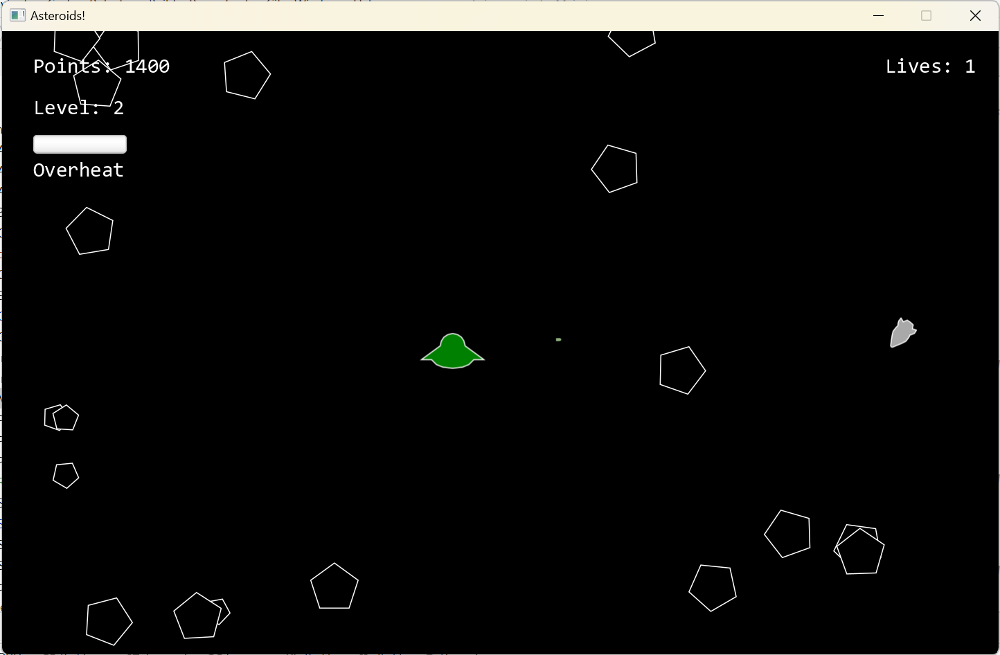
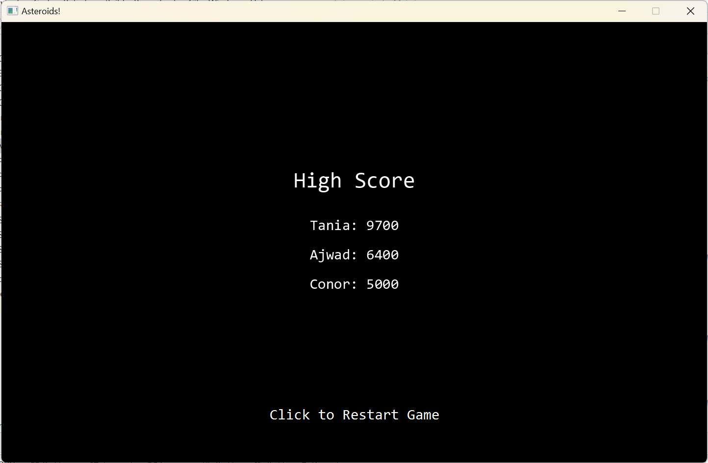
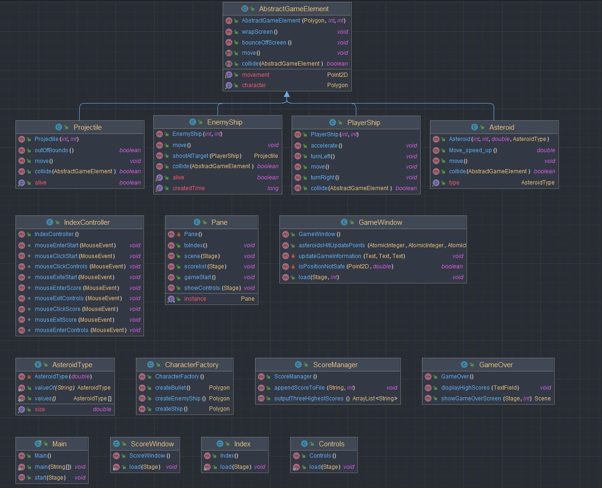

# Java Asteroids Game

The following is a clone of the classic Atari Asteroids game made for our course COMP30820.
  
## Screenshots
  

  

## Contributions
**Ajwad Javed**
  
Initially we had divided the project into each member picking a core functionality out of Ship, Asteroids, Bullet, etc. Tania, Yuntao and I chose to work on the Ship over the spring break. I had a version running with the ship moving across a main game screen while shooting bullets. However, as we had to refactor and reorganise all the code into multiple branches and create further methods to touch on each functionality in our game the final version of my initial Ship class was either refactored or deleted to suit our specifications and needs.

Then, I started working on creating the High Score backend/frontend functionality. For that I wrote two classes: ScoreManager and ScoreWindow and worked on creating appropriate FXML references and contributed code for the GameWindow and GameOver classes (to represent the start screen and ending screen), and also added animations and worked on the project documentation. As a group we helped each other in their parts and everyone gave solid contributions and suggestions on how to make the game run more cohesively and smoothly while having group discussions on which and how many classes we should break the entire game into.
  
**Tania Lopes**
  
During the Asteroids group project, I engaged in several aspects of the game's development, contributing to its overall progress and completion. At the project start I created an outline of potential classes to divide the game into, and worked on versions of the implementation of the ship and asteroids classes, though ultimately these didn’t make it into the final version of the game. As the project progressed, I became focused on code structure and organisation. When the team began to bring together the different components of the project, I worked on merging of the different branches and consolidating the code into methods, improving the readability and reusability of the code, and making sure that everyone’s code was compatible, making adjustments as necessary when it was not. I added a GameOver screen which appears within the same window as the main game, displaying the highscores and allowing the user to restart the game (resetting all variables and game states as necessary), participated in developing the Asteroid Type Enum and Projectile Type Enum, and gave suggestions for implementation of the Ship interface. Most notably, I created the  BaseGame base class, which streamlined shared functionality between GameWindow and ControlsWindow classes, reducing the amount of redundant code between the two classes, and overriding when needed to allow for custom behaviour. Overall though, it’s fair to say that everyone played a part in all aspects of the game design and implementation, and touched all parts of the code as necessary to create the final product.
  
**Conor McElduff**
  
As a group, we initially assigned tasks to each individual by dividing the required classes into separate divisions. However, this approach made it challenging for each group member to find a solid foundation to build upon. I was responsible for creating the basic functionality and fundamentals of our group's Asteroids project. Tania had the great suggestion of creating a branch for each member to facilitate code merging. Therefore, I decided to establish a master branch that allowed each member to add their individual work based on the basic functionalities. My initial contributions to the project involved creating the following classes: AbstractGameElement, Asteroid, AsteroidsApplication, Character, EnemyShip, GameWindow, Index, IndexController, Main, Pane, PlayerShip, PolygonFactory, Projectile, Score, and Ship. Several of these classes, such as AsteroidsApplication, Character, PolygonFactory, and Score, were either deleted or refactored to enhance the gameplay's functionality and performance. This also included Yuntao adding his enemy ship into the basic EnemyShip class. The original functionality required numerous changes and bug fixes, and all four group members made exceptional contributions to this base code. As the project progressed, I collaborated with Ajwad to fix minor errors in the ending high score list, improve design flaws in the visuals, and enhance the overall appearance of the gameplay. I also helped James identify minor issues related to gameplay speed and lag, which he successfully resolved. Additionally, I implemented the hyperspace jump within the controls window, which was originally created by James.
  
**James McKeon**
  
I was a highly effective contributor throughout each stage of development, and my stamp is clearly visible on the final product. In the earliest stage I created the first draft of the Class Diagram which shaped the division of the initial work amongst the team. This class structure was expanded upon by other team members. My initial work toward the Asteroid class and AsteroidType Enum persisted, with the core design/functionality present in the final product. I identified a performance slowdown as the number of Asteroid and Projectile objects increased. I attributed this slowdown to the handling of out-of-bounds projectiles and unnecessary checks for collisions every frame ensuing as a result. I solved this issue by enforcing frames between projectile creation, limiting the size of the projectile list (now a more appropriate linked list), and removing projectiles from the pane/list when out of bounds. Gameplay issues solved include preventing PlayerShip from maintaining speed upon respawn, enforcing frames between hyperspace jumps and allowing moving and shooting at the same time. Structural changes included the creation of the AsteroidType Enum and Ship interface (implemented by both ship classes). I created three (3) features which are additional to the project spec: a cheat key (press 'u' from level 3 onwards, destroys all asteroids but eliminates user progress / displays an annoying message); an 'overheat' bar (progress bar tied to number of projectiles fired); and the ControlsWindow where the user can practice basic controls. Finally, it’s appropriate to commend the entire team for their contributions. I am satisfied that every team member was enthusiastic and complemented each other with our individual strengths, which is apparent in the result.
  
**Yuntao Wei**
  
In this project, I mainly implement all the functions of Alien Ship and some of the functions of Player Ship. For Alien Ship, I mainly implement its generation (generated in a random place on the screen after a certain time at the beginning of the game and after being destroyed), random movement (Alien Ship will randomly change its movement direction every certain time) and shooting at the player ship (creating a Projectile and applying movement based on the information of Player Ship's position obtained at that time).

For the Player Ship part, I implemented Hyperspace Jump to determine if the Player Ship can be moved to a new location by creating a method to determine if the location is safe (by passing in a list of Asteroids, Enemy Ship, Enemy Projectile to determine if these objects exist at the new location). can be moved to the new location. As well, each time the Player Ship is destroyed and reset it gains 3 seconds of invincibility (the ship can ignore collisions) and adds a ship blink animation during this time.

## Contact
  
If you have any questions or need further information, please contact the project owner or contributors via the GitHub repository.
